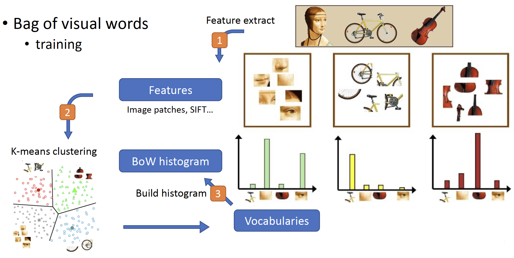

# HW2: Recognition/Classification

## Part 1: Bag-of-Words Scene Recognition

## Part 2: CNN Image Classification
- **Image classification – predict a label for each image**
  - **Input : RGB image**
  - **Output : classification label**

- **You need to perform image classification with the following methods:**
  - **Build and train a CNN model from scratch**
    - **torchvision.models, pretrained weights is NOT allowed.**
  - **Try ResNet18 model**
    - **You can use torchvision.models.resnet18(weights=“<pretrained-model>”).**
    - **You may have to modify the structure to pass the strong baseline.**

---
## Requirements
- Python 3.8
- torch==2.2.1
- torchvision==0.17.1
- torchaudio==2.2.1
- matplotlib==3.7.5
- numpy==1.24.0
- Pillow==10.4.0
- scikit-learn==1.3.2
- scipy==1.8.1
- tqdm==4.67.1
- gdown==5.2.0

---
## Usage
- **To run Part 1, use the following command:**  

- **To run Part 2, use the following command:**  

---
## Submission
- Please submit those two files, i.e. your StudentID.zip and report.pdf,
separately to NTU COOL
- Deadline: 2025/03/27 (Thu.) 23:59